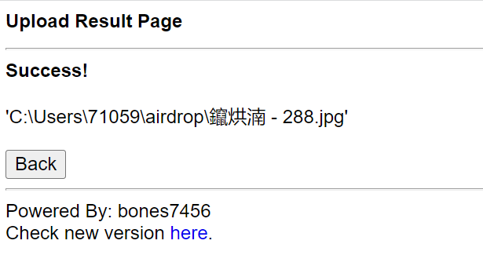

# 1 软件简介
       软件使用python进行软件开发，pycharm作为开发平台。开发后用ubuntu虚拟机打包为.apk文件，手机安装即可使用，而电脑端需运行.py文件。软件旨在实现同一局域网下，Android端与PC端的文件互传以及Android端复制、PC端即可粘贴的功能。
       Android端与PC端的文件互传功能实现为：用户点击软件中对应功能按钮，将自动跳转到PC端预先设定的网站服务器，进行上传与下载文件的交互，PC端也可在该服务器上传与下载文件。Android端复制、PC端即可粘贴的功能实现为：通过手机上开发独立Android应用来读取系统clipboard的文本内容，并自动发送文本至PC端，PC端使用相应快捷键即可粘贴内容。

# 2 软件使用方法
## 2.1 文件互传
- 通过点击软件对应功能按钮，跳转到http网站服务器实现。
- 环境：PC（windows)/mobile(Andriod)
### 2.1.1 PC端运行
- 运行airdrop2.py，然后在浏览器中进入http://192.168.43.173:8000（或http://localhost:8000）。
  
- 服务器上所显示的所有文件，点击即可下载到PC端。
  
- 点击选择文件。选定文件后，点击upload，可以发现选择的文件名出现在页面上。最后单击upload即可成功上传至服务器。
 
  
### 2.1.2 Andriod端运行
- 单击File Transmit按钮，Android端将自动跳转到处于同一局域网的PC端预先设定的服务器中。


- 服务器上所显示的所有文件，点击即可下载到Android端。


- 点击选择文件。选定文件后，点击upload，可以发现选择的文件名出现在页面上。最后单击upload即可成功上传至服务器。


## 2.2 共享剪贴板
- 云剪切板可以跨设备共享数据，因此我们可以通过它来实现一个设备复制另一个设备粘贴
- 环境：PC（windows)/mobile(Andriod)
### 2.2.1 PC端运行
- 安装依赖库
```bash
pip install requests pyperclip
```

- clone库，终端打开项目所在路径，运行cloudPC.py

```bash
python cloudPC.py register <用户名> <密码>
```
- 输入自己的用户名密码——将用于移动端登录
- 设置快捷方式
> ctrl+Alt+C——上传剪切板内容至云剪切板上
> 1. 桌面右键-新建-快捷方式
> 2. 添加路径
> `C:\Windows\System32\cmd.exe /c python (项目路径)\cloudPC.py copy <用户名> <密码>`
> 3. 下一步，完成

> ctrl+Alt+C——上传剪切板内容至云剪切板上
> 1. 桌面右键-新建-快捷方式
> 2. 添加路径
> `C:\Windows\System32\cmd.exe /c python (项目路径)\cloudPC.py copy <用户名> <密码>`
> 3. 下一步，完成
- PC端实现
> 1. 在电脑端复制后，ctrl+Alt+C更新到云剪贴板
> 2. ctrl+Alt+V获取云剪贴板最新内容，粘贴即可
### 2.2.2 Andriod端运行
- 移动端和PC端需要在同一局域网下
  
- 登录  
  

> 需输入在电脑端注册时的用户密码，完成登录  

- 功能界面  

> 1.点击File Transmit按钮可进行文件传输  
> 2.手机端任意复制后，在Current Local Clipboard 中会出现复制内容，点击Upload即可上传到云剪贴板  
> 3.Current CloudClipboard中显示云剪贴板内容，点击Refresh更新  
> 4.在手机端可粘贴Current CloudClipboard中的最新内容

# 3 关键代码
## 3.1 文件传输功能的实现
### 3.1.1 处理下载请求
```python
def do_GET(self):
    f = self.send_head()
    if f:
        self.copyfile(f, self.wfile)
        f.close()
    return True
```
> copyfile()用于复制文件数据，send_head()用于页面展示
### 3.1.2  处理上传请求
``` python
def do_POST(self):
    r, info = self.deal_post_data()
    print((r, info, "by: ", self.client_address))
    f = BytesIO()
    f.write(b'<!DOCTYPE html PUBLIC "-//W3C//DTD HTML 3.2 Final//EN">')
    f.write(b"<html>\n<title>Upload Result Page</title>\n")
    f.write(b'<style type="text/css">\n')
    f.write(b'* {font-family: Helvetica; font-size: 16px; }\n')
    f.write(b'a { text-decoration: none; }\n')
    f.write(b'</style>\n')
    f.write(b"<body>\n<h2>Upload Result Page</h2>\n")
    f.write(b"<hr>\n")
    if r:
        f.write(b"<strong>Success!</strong>")
    else:
        f.write(b"<strong>Failed!</strong>")
    f.write(info.encode())
    f.write(("<br><br><a href=\"%s\">" % self.headers['referer']).encode())
    f.write(b"<button>Back</button></a>\n")
    f.write(b"<hr><small>Powered By: bones7456<br>Check new version ")
    f.write(b"here</a>.</small></body>\n</html>\n")
    length = f.tell()
    f.seek(0)
    self.send_response(200)
    self.send_header("Content-type", "text/html")
    self.send_header("Content-Length", str(length))
    self.end_headers()
    if f:
        self.copyfile(f, self.wfile)
        f.close()
    return True
```
> 处理该请求以及相应前端
### 3.1.3 处理上传数据
```python
def deal_post_data(self):
    uploaded_files = []   
    content_type = self.headers['content-type']
    if not content_type:
        return (False, "Content-Type header doesn't contain boundary")
    boundary = content_type.split("=")[1].encode()
    remainbytes = int(self.headers['content-length'])
    line = self.rfile.readline()
    remainbytes -= len(line)
    if not boundary in line:
        return (False, "Content NOT begin with boundary")
    while remainbytes > 0:
        line = self.rfile.readline()
        remainbytes -= len(line)
        fn = re.findall(r'Content-Disposition.*name="file"; filename="(.*)"', line.decode())
        if not fn:
            return (False, "Can't find out file name...")
        path = self.translate_path(self.path)
        fn = os.path.join(path, fn[0])
        line = self.rfile.readline()
        remainbytes -= len(line)
        line = self.rfile.readline()
        remainbytes -= len(line)
        try:
            out = open(fn, 'wb')
        except IOError:
            return (False, "<br><br>Can't create file to write.<br>Do you have permission to write?")
        else:
            with out:                    
                preline = self.rfile.readline()
                remainbytes -= len(preline)
                while remainbytes > 0:
                    line = self.rfile.readline()
                    remainbytes -= len(line)
                    if boundary in line:
                        preline = preline[0:-1]
                        if preline.endswith(b'\r'):
                            preline = preline[0:-1]
                        out.write(preline)
                        uploaded_files.append(fn)
                        break
                    else:
                        out.write(preline)
                        preline = line
    return (True, "<br><br>'%s'" % "'<br>'".join(uploaded_files))
```
> 处理文件为我们需要的格式再进行上传
### 3.1.4 复制文件数据
```python
def copyfile(self, source, outputfile):
    shutil.copyfileobj(source, outputfile)
```
### 3.1.5 判断文件类型
```python
def guess_type(self, path):
    base, ext = posixpath.splitext(path)
    if ext in self.extensions_map:
        return self.extensions_map[ext]
    ext = ext.lower()
    if ext in self.extensions_map:
        return self.extensions_map[ext]
    else:
        return self.extensions_map['']
 
```
## 3.2 共享剪贴板的实现
### 3.2.1 返回剪贴板内容
```python
def copy():
    # 读取剪贴板数据为字符串
    data = pyperclip.paste()
    return data
```

### 3.2.2 上传剪贴板内容到云剪贴板
```python
def upload(username, password):
    payload = {"text": copy(), "device": ""}
    result = requests.post(
        server_url+"copy-paste/",
        data = payload,
        author = (username, password)
    )
    if result.status_code == 200:
        print("Succesesfully copied to Cloud-Clipboard!")
        return True
    else:
        print("Error: ", res.text)
        return False

```
### 3.2.3 将数据更新至本机剪贴板
```python
def paste(data):
    pyperclip.copy(data)
```
### 3.2.4 获取云剪贴板数据并更新到本机剪贴板
```python
def download(username, password):
    result = requests.get(server_url+"copy-paste/", auth = (username, password))
    if result.status_code == 200:
        paste(json.loads(res.text)["text"])
        return True
    else:
        print("ERROR:Cannot download the data.")
        return False
```

### 3.2.5 实现用户注册
```python
def register(username, password):
    payload = {"username": username, "password": password}
    result = requests.post(server_url+"register/", data=payload)
    if result.status_code == 201:
        print("Successfully regist!" % username)
        return True
    else:
        print("Error: ", res.text)
        return True
```
## 3.3 Andriod端实现
### 3.3.1 文件传输
```python
def webTransit(ip,port):
    webbrowser.open("http://"+ip+":"+port)
```
### 3.3.2 获取当前云剪贴板数据
```python
def download(self, *args):
    self.paste_res = UrlRequest(
        self.url,
        req_headers = self.header,
        on_success = self.paste,
        on_error = utils.show_error,
        on_failure = self.show_failure
    )       
```
### 3.3.3 将数据更新至本机剪贴板
```python
def paste(self, req='', res=''):
    Clipboard.copy(res['text'])
    self.update_cloud_clip()  
```
### 3.3.4 上传数据到云剪贴板
```python
def upload(self, *args):
    payload = urllib.parse.urlencode({'text': self.old_text})  # python3
    #payload = urllib.urlencode({'text': self.old_text})  # python2
    self.header['Content-type'] = 'application/x-www-form-urlencoded'
    copy_res = UrlRequest(
        self.url,
        req_headers = self.header,
        req_body = payload,
        on_success = self.paste,
        on_error = utils.show_error,
        on_failure = self.show_failure
    )
```
### 3.3.5 返回剪贴板数据
```python
def copy(self):
    return Clipboard.paste()
```
# 4 单元测试
## 4.1 文件传输测试
### 4.1.1 单元测试函数如下
```python
class MyTestCase(unittest.TestCase):
    def test_fbytes(self):
        result = fbytes(6243850000)
        self.assertEqual(result, '5.82 GB')

    def test_do_GET(Handler):
        result = Handler.do_GET(Handler)
        self.assertEqual(result, 'True')

    def test_do_POST(Handler):
        result = Handler.do_POST(Handler)
        self.assertEqual(result, 'True')
```
### 4.1.2 单元测试结果

## 4.2 共享剪贴板测试
### 4.2.1 单元测试函数如下
```python
class Test(TestCase):
    def test_register(self):
        self.assertTrue(cl.register('abcd3233546','bbb'))

    def test_upload(self):
        self.assertTrue(cl.upload('bbb','bbb'))

    def test_download(self):
        self.assertTrue(cl.download('bbb','bbb'))
```
## 4.2.2 单元测试结果


# 5 持续集成
- 虚拟环境：windows-latest
- 编译：Python3.8
- 配置库requirement.txt 
    ```python
    requests == 2.25.1
    pyperclip == 1.8.2
    ```
- 集成完成


- 详细信息


# 6 软件亮点
- 在实现手机电脑局域网互传文件时，上传文件至共同服务器时可一次性选择多个文件同时，提高传送效率。


- 我们的软件可真正意义上实现当手机和电脑位于同一局域网下时，手机端复制，电脑端粘贴的功能。即通过手机上开发独立Android应用来读取系统clipboard的文本内容，并自动发送文本，而不用借助在网站上先“过渡地粘贴到某文本框”的妥协步骤。

- 我们的软件整体设计风格为蓝、黑纯色，简单耐看的UI设计与无广告的清晰界面，也是吸引用户使用的一大亮点。


